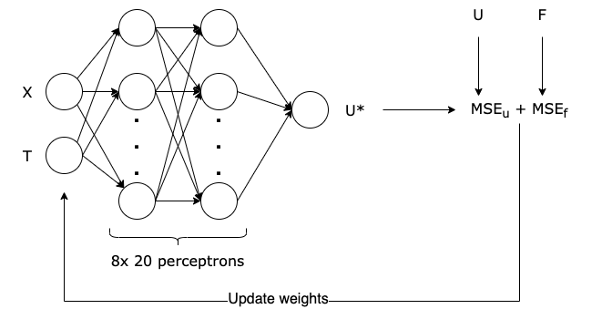
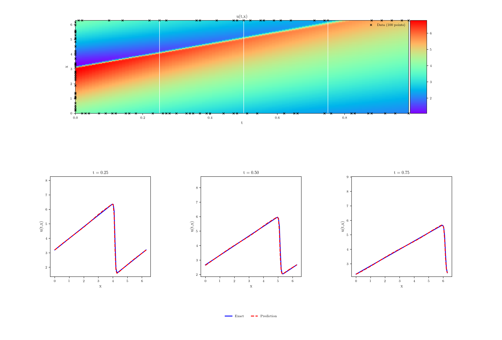

# Physics-informed Neural Networks: Burgers Equation
<span> </span>

Physics-informed Neural Networks are a type of neural networks that are trained to solve supervised learning tasks while respecting any given laws of physics described by general nonlinear partial differential equations.

in this repository we introduced PINNs applied to [Burgers Equations](https://en.wikipedia.org/wiki/Burgers%27_equation). Therefore, in this repository we will apply PINNs to solve the equation through a Multi Layer Perceptron (MLP).

## PINNs Schematic

Shown below is a schematic drawing of the network used for **1D Burgers Equation**.




## How to run it

To run the training you need to have the `x` and `t` simulation file in `.pkl` (pickle) format. Then, install the requirements:

```bash
pip3 install -r requiments.txt
```

To plot results in Latex format, we need to download necessary configurations:

```bash
sudo apt-get install texlive-latex-extra texlive-fonts-recommended dvipng cm-super
```

And finally, run training:

```bash
python3 train.py --save_path /example/weights.pt
```

### 2D Burgers equation

To train 2D burgers equation put data file at root of the project with name `burger_data_2d.mat`. Then, run de follow command, changing desired hiperparameters:

```bash
python train_2d.py --path /test/path/aa.pt --epochs 100000 --nu 5000 --nf 50000 --a 3.4
```

## Results for 1D Burgers Equation

After training, the results in shown below.



From the figure above, we can see that the network, even if simple, managed to represent well the solution of the proposed differential equation.

## References
- Ehsan Haghighat, Maziar Raissi, Adrian Moure, Hector Gomez, and Ruben Juanes. **“A physics-informed deep learning framework for inversion and surrogate modeling in solid mechanics”**. In: Computer Methods in Applied Mechanics and Engineering 379 (2021), p. 113741. URL: https://bit.ly/3nInVEP.

- Maziar Raissi, Paris Perdikaris, and George E Karniadakis. **“Physics-Informed Neural Networks: A Deep Learning Framework for Solving Forward and Inverse Problems Involving Nonlinear Partial Differential Equations”**. In: Journal of Computational Physics 378 (2019), pp. 686–707. URL: https://bit.ly/2SmVsqq.

- JARED WILLARD and XIAOWEI JIA, SHAOMING XU, MICHAEL STEINBACH, MICHAEL STEINBACH. **"Integrating Physics-Based Modeling With Machine Learning: A Survey"**. arXiv:2003.04919v4.

- Massachusetts Institute of Technology (MIT). **18.337J/6.338J: Parallel Computing and Scientific Machine Learning**. Lectures Notes.

- Barba, Lorena A., and Forsyth, Gilbert F. (2018). **CFD Python: the 12 steps to Navier-Stokes equations**. Journal of Open Source Education, 1(9), 21, https://doi.org/10.21105/jose.00021.


## Contributors
The list of contributors is presented below.
<table>
  <tr>
    <td align="center"><a href="https://github.com/WesPereira"><br /><sub><b>WesPereira</b></sub></a><br /></td>
    <td align="center"><a href="https://github.com/esgomi"><br /><sub><b>esgomi</b></sub></a><br /></td>
    <td align="center"><a href="https://github.com/marlonsmathias"><br /><sub><b>marlonsmathias</b></sub></a><br /></td>
  </tr>
</table>